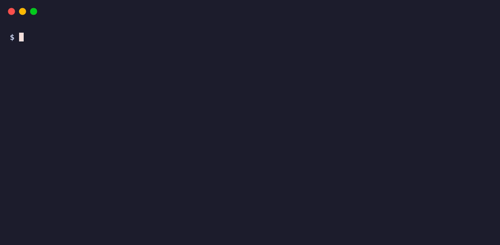

# skctl

[](https://github.com/trevorrecker/skctl/actions/workflows/ci.yml)
[](https://www.npmjs.com/package/@trevorrecker/skctl)

`skctl` ("SKUT-ul") manages agent skills, commands, and shared instructions across Claude Code,
Codex, OpenCode, and Cursor. It keeps one source root, compiles each skill for the
clients that will read it, and reconciles their user or project directories.

It also tracks skills from any Git repository and layers your own edits on top with
overlays, so your customizations survive every upstream update.

## Install

Install the command globally:

```bash
npm install --global @trevorrecker/skctl
```

Or run a one-off command with `npx`:

```bash
npx @trevorrecker/skctl --help
```

## Quick start



Point skctl at a root, then adopt the skills you already keep on disk:

```bash
skctl init ~/dev/skills
skctl import
```

`init` creates the root and records it in the machine-local skctl config. `import`
adopts your existing skill directories and compiles them for every client. Run
`skctl apply` after a change, or `skctl status` to check for drift without writing.

Root resolution follows `--root`, then `SKCTL_ROOT`, then the root in
`${XDG_CONFIG_HOME:-~/.config}/skctl/config.json`.

## Keep the library in Git

Put the root under Git so the source and catalog travel between machines. skctl
rebuilds `.build/` and remote clones, so both stay ignored:

```bash
git -C ~/dev/skills init -b main
git -C ~/dev/skills add .
git -C ~/dev/skills commit -m "chore: start skill library"
git -C ~/dev/skills remote add origin <repository-url>
git -C ~/dev/skills push -u origin main
```

On another machine, clone the repository, then `skctl init ~/dev/skills` records the
root and `skctl pull` applies the library.

## Build your catalog

`import` adopts loose skill directories under `~/.agents/skills`. Preview what it will
take before it runs:

```bash
skctl import --dry-run
skctl import
```

Install every skill from a Git repository, or narrow the selection with
`--skills one,two`:


```bash
skctl remote add https://github.com/owner/skills example
skctl remote add https://github.com/mattpocock/skills pocock --skills wayfinder
```

Nested layouts work. When a repository contains the same skill name in more than
one plugin, use a qualified selector. Poteto's pstack in the Cursor plugin catalog
is one example:

```bash
skctl remote add https://github.com/cursor/plugins plugins --skills pstack/unslop,pstack/bro
```

Use the terminal picker when you would rather inspect the catalog first:

```bash
skctl browse plugins
skctl browse https://github.com/owner/skills
```

Arrow keys or `j`/`k` move, space toggles a skill or plugin, `p` previews a
`SKILL.md`, `/` filters, enter reviews and commits, and `q` leaves without writing.
Without a terminal, browse prints the catalog and exits without changing it.

Remote clones live under `remotes/<alias>`. `pull` fast-forwards them and applies
the result. `detach` copies one selected remote skill into local source and removes
its remote selection.

Keep local changes to remote skills in `overlays/<skill>.md`. An overlay can add
or remove frontmatter and run ordered find-and-replace rules across the skill body.
Each change can apply to every compiled copy or one client-specific copy. The
overlay stays outside the clone, so `pull` can refresh the upstream source without
losing your adaptation. Use `detach` when you want to stop following upstream and
own the full source instead.

```bash
skctl pull
skctl pull pocock
skctl detach skill wayfinder
skctl remote remove pocock
```

## Keep skills without loading them

Skills and commands start enabled. Direct toggles live in the shared manifest and
apply immediately:

```bash
skctl disable skill code-review
skctl enable skill code-review
```

`disable skill` writes to `skills.config.json` and applies on this machine. Other
machines remove the skill after they pull the shared root and apply.

### Choose tags on this machine

Tags provide a machine-local activation layer. Membership lives in the shared
manifest; the active tag list lives in local config:

```bash
skctl tag skill work-tool work
skctl enable tag work
skctl disable tag work
skctl get tags
```

`tag` and `untag` only edit membership. `enable tag` and `disable tag` apply the new
machine-local selection. Untagged skills form the common layer.

## How apply works

Clients accept different frontmatter and read overlapping skill directories. skctl
therefore writes one compiled copy per selected output surface, then links the
client-visible path to that build:

```text
~/.claude/skills/code-review  ->  <root>/.build/claude/code-review
~/.agents/skills/code-review  ->  <root>/.build/agents/code-review
```

The compiler:

1. Applies a local overlay when one exists.
2. Resolves host guards.
3. Keeps only frontmatter the output surface accepts.
4. Pins `name` to the skill directory.
5. Links bundled files such as `scripts/` and `assets/` back to source.

`skctl describe skill <name>` shows declared hosts, output surfaces, and extra
readers caused by client compatibility paths. A guard or surface overlay can
change content only inside the skill's declared host reach.

```markdown
<!-- host:claude -->
Read @notes.md before starting.
<!-- /host -->
<!-- host:!claude -->
Read notes.md before starting.
<!-- /host -->
```

`host:raycast` selects the body copied by the Raycast paste command. See
[surfaces and overlays](docs/surfaces.md) for the reader matrix, supported
frontmatter, overlay format, and conflict rules.

## Shared instructions

Track one instruction source at `instructions/AGENTS.md`:

```bash
skctl import instructions
skctl instruction list
skctl instruction add ~/.codex-work/AGENTS.md
skctl instruction remove ~/.codex-work/AGENTS.md
```

Import adopts matching `~/AGENTS.md` and `~/CLAUDE.md` content when they agree and
reports them when they differ, rather than guessing a merge. Apply resolves the source's
`<!-- host:... -->` guards for each target and writes the file, so a `host:claude` block
reaches `CLAUDE.md` but not the `AGENTS.md` a Codex or OpenCode reads. A target you edit by
hand is reported as a conflict and left untouched. See [client paths](docs/clients/README.md)
for each client and [surfaces and overlays](docs/surfaces.md) for the guard syntax.

## Project a subset

Project mode selects part of the global root for one repository:

```bash
skctl project init --tags work
skctl project init --skills code-review,unslop --copy
skctl project
skctl project status
skctl project remove
```

`--link` writes a local build and symlinks. `--copy` writes real skill directories
that a repository can carry. Both modes refuse to replace paths skctl does not own.
Project selectors respect an explicit global disable. Their `--tags` selector is
independent of the machine's active global tags.

skctl ignores only its generated `.agents/.build/` and
`.agents/skctl.project.json` state in the project root. It does not hide copied or
hand-written skills. The `--project[=DIR]` global flag does a different job: it uses
`<DIR>/.agents` as the source root.

## Refresh, scheduling, and Raycast

`skctl refresh` fast-forwards a clean root, updates remotes, and applies. It leaves
a dirty root untouched and reports a conflict.

On macOS, skctl can install a launchd job:

```bash
skctl schedule install 24h
skctl schedule status
skctl schedule remove
```

Other platforms can schedule `skctl refresh --quiet --no-color` with their native
scheduler. See [scheduled refresh](docs/scheduling.md).

Raycast script generation defaults on only for macOS global roots:

```bash
skctl config set raycast off
skctl config set raycast on
skctl config set raycast ~/path/to/script-commands
skctl apply --no-raycast
```

See [Raycast setup](raycast/README.md).

## Output and automation

Color follows the terminal and honors `NO_COLOR`, `FORCE_COLOR`, and `--no-color`.
Conflicts and status issues exit with status 1. Invalid input and runtime failures
also exit with status 1.

Use JSON for automation:

```bash
skctl apply --output json | jq '.summary'
skctl status --output json | jq '.issues'
```

`--dry-run` plans supported write operations without changing files. `--quiet`
prints only conflicts and the final summary.

## Command reference

```text
skctl init [dir]
skctl config [set root|raycast|refresh <value>]
skctl create skill|command [name]
skctl import [skills|instructions]
skctl get skills|commands|remotes|tags [name]
skctl describe skill|command|remote|tag <name>
skctl apply
skctl enable|disable skill|command|tag <name>
skctl tag|untag skill <name> <tag...>
skctl remote add <url> [alias] | remove <alias> | list
skctl browse [alias|url]
skctl pull [remote]
skctl detach skill <name>
skctl instruction list|add|remove [path]
skctl project [apply]|init|status|remove
skctl refresh
skctl schedule install [hours]|status|remove
skctl raycast sync [--dir <path>]
skctl status
```

Run `skctl --help` for flags and current usage.

## Development

```bash
npm install
npm test
npm pack --dry-run
```

`npm test` builds first and runs the Node test suite against the compiled package.
CI covers Node 22.13, 24, and 26 on Linux and Node 24 on macOS and Windows.
